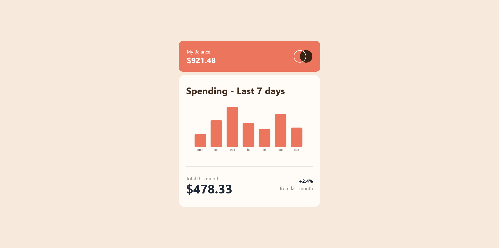

# Frontend Mentor - Expenses chart component solution

This is a solution to the [Expenses chart component challenge on Frontend Mentor](https://www.frontendmentor.io/challenges/expenses-chart-component-e7yJBUdjwt).

## Table of contents

- [Overview](#overview)
  - [The challenge](#the-challenge)
  - [Screenshot](#screenshot)
  - [Links](#links)
- [My process](#my-process)
  - [Built with](#built-with)
  - [What I learned](#what-i-learned)
  - [Continued development](#continued-development)

**Note: Delete this note and update the table of contents based on what sections you keep.**

## Overview

### The challenge

Users should be able to:

- View the bar chart and hover over the individual bars to see the correct amounts for each day
- See the current day’s bar highlighted in a different colour to the other bars
- View the optimal layout for the content depending on their device’s screen size
- See hover states for all interactive elements on the page
- **Bonus**: Use the JSON data file provided to dynamically size the bars on the chart

### Screenshot

### Links

- Solution URL: [expense-chart-component-github](https://github.com/shrabanchakma/expenses-chart-component-main)
- Live Site URL: [expense-chart-component-live-site](https://eloquent-tapioca-0591a8.netlify.app/)

## My process

### Built with

- [React](https://react.dev/) - JS library
- [Tailwind](https://tailwindcss.com/) - CSS library
- [DaisyUi](https://daisyui.com/) -Tailwind library
- [React-chartjs-2](https://react-chartjs-2.js.org/) - JS library
- [chartjs](https://www.chartjs.org/) - JS librar

### What I learned

I wanted to try out a new library for charts. I used chartjs for this case. It was challenging at first. I came to know about many terms related to charts such as different types of charts, gird, ticks, legend, label, tooltip and so on. I also got to be familiar with tree-shaking that chartjs uses.
The best takeaway is that know I how to approach to a new library and be familiar with it.

### Continued development

Next I will be focusing on building other types of charts such as doughnut, line, radar etc. Once I'm comfortable with these I want to try out my bubble and scatter chart. These things looks very exciting to work on.
